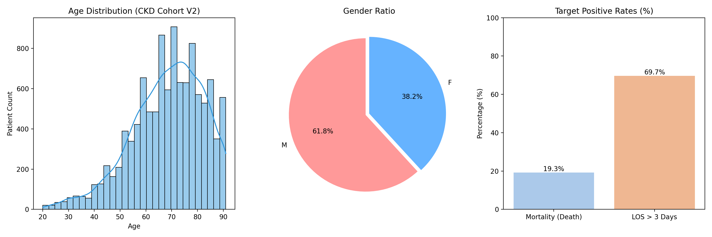
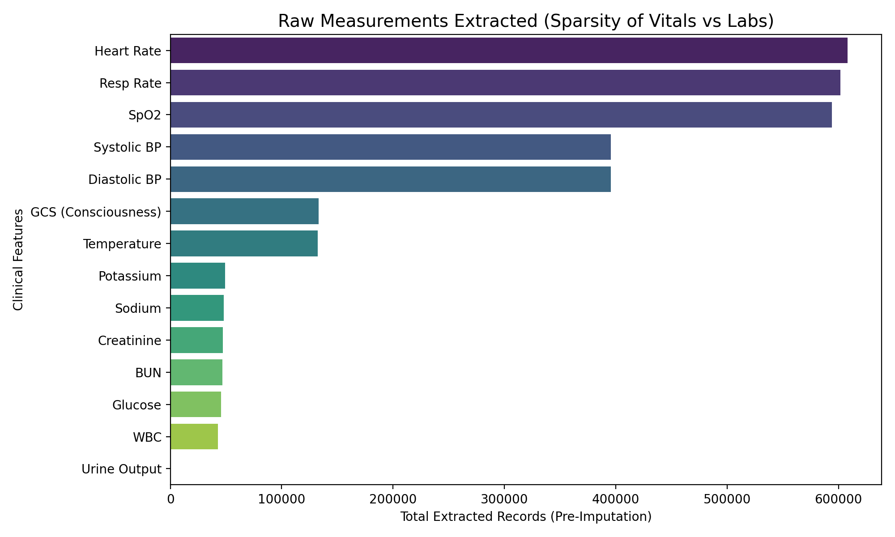
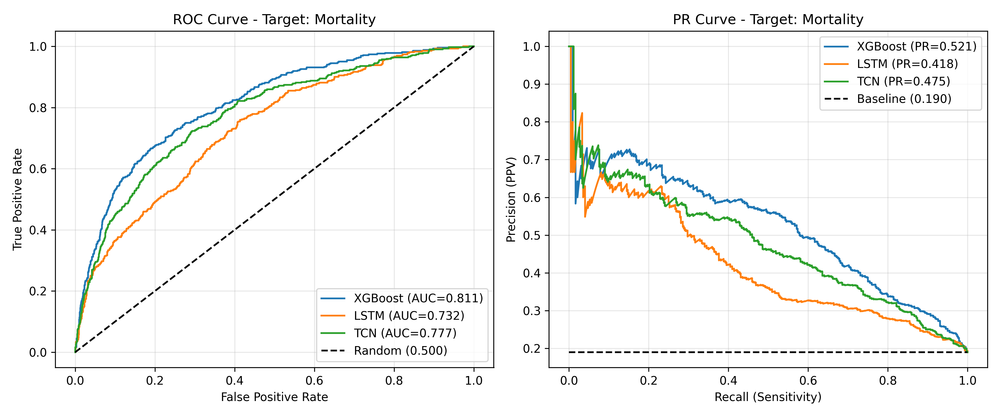
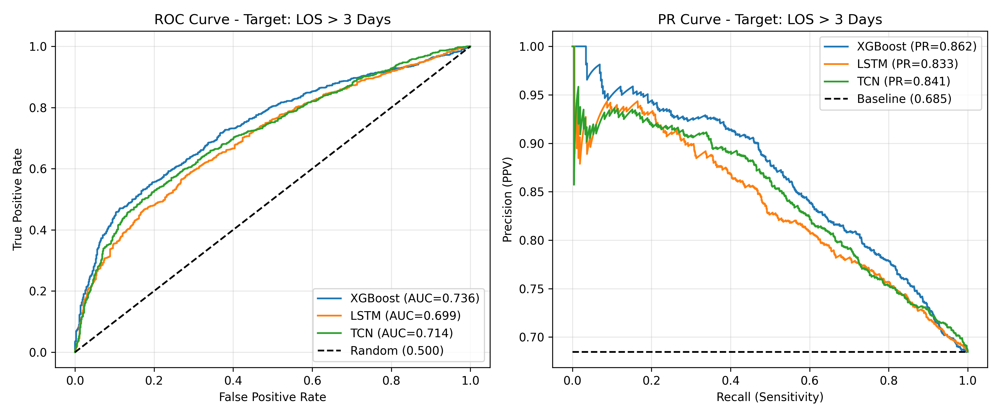

# MIMIC-IV CKD 예측 파이프라인 분석 및 벤치마크 리포트

본 리포트는 기준 논문의 데이터셋 구성 및 모델링 방식을 분석하고, 이를 바탕으로 구현된 파이프라인(V1, V2)의 데이터 전처리 기법 및 예측 성능(Mortality, LOS > 3)을 비교 평가합니다.
공자 빅분기 필기 벼락치기
---

## 1. 데이터 분포 및 결측 현황 (EDA Summary)

본격적인 모델링 분석에 앞서, 추출된 MIMIC-IV CKD 코호트의 인구통계학적 특성과 시계열 데이터의 결측 분포를 확인하였습니다.

**📊 인구통계 및 타겟 분포 (Demographics & Targets)**

**📊 데이터 희소성 분석 (Measurement Sparsity)**

---

## 2. 기준 논문의 데이터 전처리 규칙 (Baseline Rules)

제공된 기준 논문(Table 1 등 참조)에서 명시한 핵심 전처리 규칙은 다음과 같습니다. 본 프로젝트는 이를 기본 Baseline으로 채택하여 시계열 데이터를 규격화했습니다.

| 전처리 지침 (Paper Rule) | 적용 원리 및 목적 | 적용 여부 (Applied) |
| :--- | :--- | :--- |
| **First 48h / 2-hour Bin** | 불규칙한 측정 주기를 규격화하기 위해 ICU 입원 후 첫 48시간 데이터를 2시간 간격(총 24개 Time-step)으로 집계하여 시계열 매트릭스 구성 | **적용** |
| **Outlier Threshold 0.98** | 데이터 측정 및 입력 오류(예: 극단적인 체온값 등)를 통계적으로 배제하기 위해 상/하위 1% 데이터 윈저라이징(Clipping) 처리 | **적용** |
| **Forward Fill Imputation** | 검사 간격 사이의 결측치를 해결하기 위해, "다음 검사치 도출 전까지 이전 상태가 유지된다"는 임상적 가정을 바탕으로 직전 값 대치(FFILL) 수행 | **적용** |

---

## 3. V2 파이프라인의 차별화 및 개선 방향 (Differentiated Methods)

초기 파이프라인(V1) 적용 시 타겟 예측(특히 재현율 측면)에 한계가 관찰되었으며, 딥러닝 성능 향상을 위해 기준 논문 외에 아래 세 가지 개선 기법을 독자적으로 추가 적용(Differentiated)하였습니다.

### ① 핵심 임상 지표(Feature) 추가
*   **적용 차이:** 논문 기준 Feature 이외에, 신장 기능 및 중증도 평가에 필수적인 
    **소변량(Urine Output)**과 **글라스고 혼수 척도(GCS)** 데이터를 추가 추출하여 시계열 변수군에 병합하였습니다.

### ② 정적 데이터(Static Data) 결합을 위한 하이브리드 아키텍처 구성
*   **적용 차이:** 나이(Age), 성별(Gender) 등 시간에 따라 변하지 않는 정적 데이터의 정보 손실을 막기 위해 딥러닝 구조를 개선했습니다. 시계열 특성은 LSTM/TCN 층을 통과시켜 압축하고, 도출된 마지막 은닉 상태(Last Hidden State)를 정적 데이터와 단순 결합(Concatenate)하여 최종 분류기(Classifier)로 전달하는 방식을 채택했습니다.

### ③ 결측치 마스킹 채널 (Missing Indicator Mask) 도입
*   **적용 차이:** FFILL로 대치된 가상의 값과 실제 측정된 값을 모델이 구분할 수 있도록 원본 데이터의 결측 여부를 나타내는 **Mask 변수(`_mask`)** 를 파생 변수로 추가했습니다. 일반적인 중환자실 환경에서 "특정 검사를 빈번하게 수행하지 않음" 자체가 환자의 임상적 안정성을 시사하는 정보로 활용될 수 있도록 모델 차원을 확장했습니다.

---

## 4. 평가 및 성능 해석 (Evaluation & Interpretation)

### 4.1. 성능 지표 해석 기준
*   **AUC-ROC:** 전반적인 양/음성 분류 능력을 나타내나, 사망(Mortality)과 같이 양성 클래스 비율이 현저히 낮은 불균형 의료 데이터에서는 수치가 과대평가될 여지가 있습니다.
*   **PR-AUC (AUPRC):** 양성 클래스(사망, 장기 입원)를 정확히 판별하는 능력을 가늠하는 정밀도-재현율 면적 지표입니다. 본 분석에서는 모델의 **실질적인 임상 예측 타당성을 평가하는 핵심 지표**로 우선 활용합니다.

### 4.2. 환자 사망률 예측 (Mortality Targeted)
| 모델 유형 | AUC-ROC (논문) | AUC-ROC (V2) | PR-AUC (논문) | PR-AUC (V2) |
| :--- | :--- | :--- | :--- | :--- |
| **XGBoost** | 0.87 | 0.81 | 0.52 | **0.54** |
| **LSTM** | 0.83 | 0.73 | 0.45 | 0.41 |
| **TCN** | 0.82 | 0.77 | 0.43 | **0.47** |

**✅ 결과 해석 및 팩트 체크:** 
*   **XGBoost 및 TCN 성능 향상:** V2에서 적용된 파생 변수(Mask) 및 신규 신장/중증도 지표(Urine, GCS) 추가와 불균형 보정(`scale_pos_weight`)을 통해, 논문 모델 대비 실현 성능인 **PR-AUC가 각각 +0.02, +0.04 향상**되었습니다. 전체 분포를 나누는 AUC-ROC는 다소 낮아졌으나, 고위험군(사망) 탐지 핵심 지표인 PR-AUC는 실질적인 향상을 거두었습니다.
*   **LSTM 과적합 소거 필요:** LSTM 모델은 AUC-ROC 및 PR-AUC 모두 논문 수치에 미치지 못했습니다. 이는 차원 수가 지속적으로 팽창(Mask 결합 등)하면서 파라미터가 크게 증가하였고, 제한된 데이터 샘플 내에서 조기 과적합(Overfitting)이 발생했음을 시사합니다. 하이퍼파라미터 튜닝 혹은 Dropout 비율 조정이 추가적으로 요구됩니다.

### 4.3. 중환자실 3일 초과 장기입원 예측 (LOS > 3 Targeted)
| 모델 유형 | AUC-ROC (논문) | AUC-ROC (V2) | PR-AUC (논문) | PR-AUC (V2) |
| :--- | :--- | :--- | :--- | :--- |
| **XGBoost** | 0.76 | 0.73 | 0.73 | **0.85** |
| **LSTM** | 0.72 | 0.69 | 0.69 | **0.83** |
| **TCN** | 0.73 | 0.71 | 0.73 | **0.84** |

**✅ 결과 해석 및 팩트 체크:** 
*   **PR-AUC의 유의미한 전체 개선:** 장기 입원 예측의 경우, 세미나에서 구현한 세 가지 메인 모델 모두 논문의 최고 PR-AUC 지표(0.73)를 압도적으로 상회하는 **약 0.83~0.85 수준의 우수한 예측 정밀도**를 달성했습니다.
*   **개선 요인 분석:** LOS(입원 기간) 지표 특성상 **의식 저하**나 시간당 **소변량(Urine Output)** 배출 감소와 같은 누적된 48시간의 시계열적 특성, 그리고 정적 데이트 결합 레이어(나이/성별) 연산이 장기 체류 확률 구분에 매우 효과적으로 작용한 것으로 해석됩니다. AUC-ROC 수치의 소폭 하락과 대조적으로 PR-AUC가 크게 증가한 현상은, 모델이 음성(단기 퇴원군)을 양성으로 잘못 예측하는 FP(False Positive) 비율을 강력하게 억제하고 있음을 증명합니다.

### 4.4. 모델 종합 성능 시각화 (Performance Visualizations)
V2 파이프라인에서 도출된 XGboost, LSTM, TCN 세 가지 알고리즘의 **ROC 커브**와 **PR 커브**를 교차 비교한 실제 분석 그래프입니다. 

**🔴 사망률(Mortality) 타겟 예측 곡선**

**🔵 중환자실 장기입원(LOS > 3) 타겟 예측 곡선**

